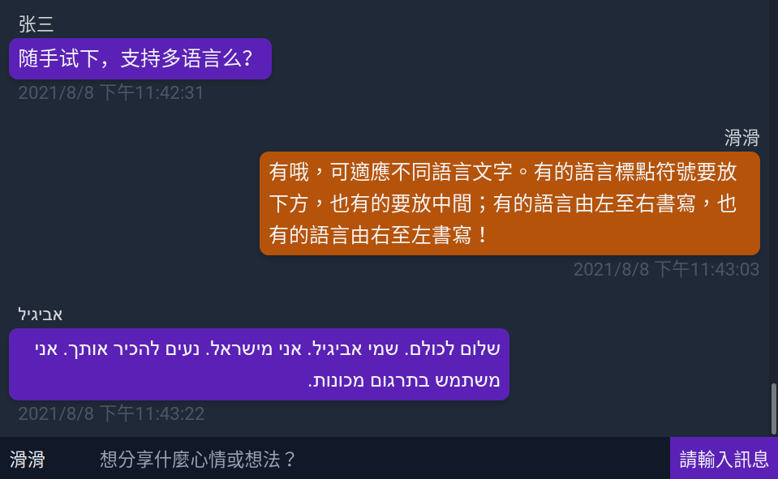
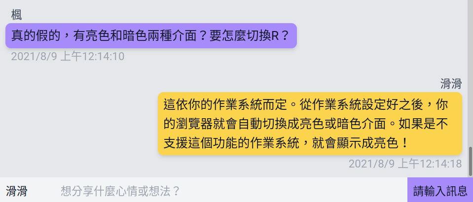

# 聊天室

網頁版聊天室，可以多人進入並以文字聊天。

以 PHP + Laravel + Vue.js + Tailwind CSS 製作，並以 WebSocket 接收新留言。目前功能如下：

* 設定暱稱、發送訊息
* 即時收到其他人傳送的訊息
* 根據作業系統設定，自動轉為亮色或暗色介面
* 回應式網頁設計（responsive web design），會根據電腦或手機介面調整版面
* 根據使用者瀏覽器語系設定，替每一則留言標記語系並調整字型
* 偵測輸入的語言以自動調整文字方向。例如輸入希伯來文會轉為右至左模式

## 螢幕擷圖





## 系統需求

* Linux（其他系統沒試過）
* Composer（PHP 套件管理器）
* Docker
* Docker Compose

## 開發模式安裝

本章節假設您想要使用本機 WebSocket 伺服器。

請先從範本建立環境設定檔：

```shell
cp .env.example .env
```

編輯環境設定檔，並任意以英文字母填入以下屬性：

* PUSHER_APP_ID
* PUSHER_APP_KEY
* PUSHER_APP_SECRET

這三個屬性只有在真正連線到 Pusher 服務時才需要正確填寫，在採用本機 WebSocket 伺服器的情況下則可隨意填寫。

環境設定檔搞定之後，再執行：

```shell
composer install
sail artisan key:generate
sail up -d
sail artisan migrate --seed # 產生測試用的留言。若不想要測試用的留言，拿掉 --seed
sail npm install
sail npm run dev # 編譯前端檔案
sail artisan websockets:serve # 啟動 WebSocket 伺服器
```

等 Docker 容器啟動後再瀏覽 <http://localhost/>。

## 已知問題

Q：進入網站之後有時候不會自動捲到最下面的留言？  
A：還在研究解法…

Q：不能回去看太久以前的訊息？  
A：目前限制只能觀看最新 100 則訊息。

Q：有沒有可能收到重複的訊息？  
A：罕見，但有可能。還在研究解法。

Q：雖然有多國語系支援，但有多重語言介面可以切換嗎？  
A：還沒有。

Q：多國語系字體看起來怪怪的？  
A：瀏覽器或作業系統的預設值不一定能完整支援，有時候則是被使用者設定干擾。
